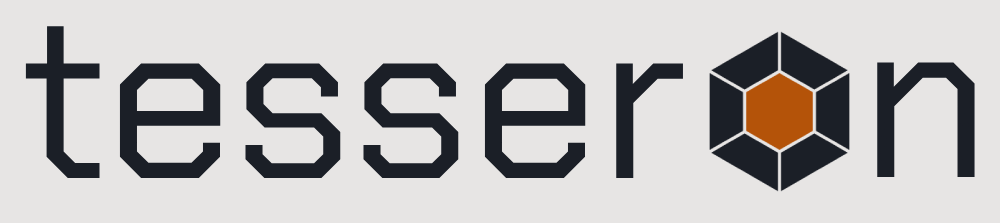
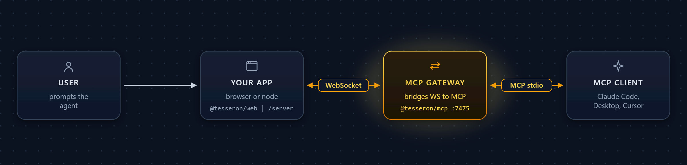

<div align="center">

<picture>
  <source media="(prefers-color-scheme: dark)" srcset="./assets/logo/tesseron-smallcaps-dark.png">
  
</picture>

### Typed live-app actions for MCP-compatible AI agents, over WebSocket.

<p>
  <a href="https://github.com/BrainBlend-AI/tesseron/stargazers"></a>
  <a href="./LICENSE"></a>
  <a href="https://discord.gg/J3W9b5AZJR"></a>
  
  
  
  
</p>

<p>
  <a href="https://brainblend-ai.github.io/tesseron/"><b>Docs</b></a> &nbsp;·&nbsp;
  <a href="./examples"><b>Examples</b></a> &nbsp;·&nbsp;
  <a href="#install"><b>Install</b></a> &nbsp;·&nbsp;
  <a href="#packages"><b>Packages</b></a> &nbsp;·&nbsp;
  <a href="https://discord.gg/J3W9b5AZJR"><b>Discord</b></a> &nbsp;·&nbsp;
  <a href="https://github.com/BrainBlend-AI/tesseron/discussions"><b>Discussions</b></a>
</p>

<a href="https://brainblendai.com/"></a> <sub>Built by <a href="https://brainblendai.com/"><b>BrainBlend AI</b></a></sub>

</div>

---

**NEW: Join our community on Discord at [discord.gg/J3W9b5AZJR](https://discord.gg/J3W9b5AZJR) — protocol questions, feedback, and SDK-contribution chat all welcome.**

Live applications (browser tabs, Electron/Tauri desktop apps, Node daemons, CLIs) declare actions with a Zod-style builder; agents (Claude Code, Claude Desktop, Cursor, Copilot, Codex, Cline, ...) call them as MCP tools. Your real handler runs against your real state. **No browser automation, no scraping, no Playwright.**

<p align="center">
  
</p>

## Why Tesseron

- **Typed actions, not scraped DOMs.** Declare with Zod or any [Standard Schema](https://standardschema.dev) validator; the handler is a plain function against your real state.
- **Framework-agnostic.** Same API for vanilla TS, React, Svelte, Vue, and Node. Pick your stack.
- **MCP-native.** Every action, resource, and capability maps to a standard MCP primitive. Users pick their agent.
- **Click-to-connect.** Six-character claim code handshake. No API keys, no OAuth dance, no per-client configuration.
- **First-class capabilities.** `ctx.confirm` for yes/no, `ctx.elicit` for schema-validated prompts, `ctx.sample` for agent LLM calls, `ctx.progress` for streaming updates, subscribable resources for live reads.
- **Cross-client delivery.** First-class install paths for Claude Code, Codex, OpenCode, and Pi — each one a single command or short config snippet that wires the [MCP gateway](./packages/mcp) in. No bundled binary; the gateway is `npx -y @tesseron/mcp@<version>` on demand.

## Install

Tesseron has first-class install paths for four agent clients. Pick the one you use:

### Claude Code

```text
/plugin marketplace add BrainBlend-AI/tesseron
/plugin install tesseron@tesseron
```

Installs the [`tesseron`](./plugin) Claude Code plugin. The MCP gateway and docs server are launched on demand via `npx`.

### Codex CLI

```bash
codex plugin marketplace add BrainBlend-AI/tesseron
```

Codex consumes the same plugin manifest as Claude Code, so the gateway, docs server, and skills come along automatically.

### Pi

Pi has no built-in MCP support, but the community-maintained [`pi-mcp-adapter`](https://www.npmjs.com/package/pi-mcp-adapter) is the canonical bridge. Install it once:

```bash
pi install npm:pi-mcp-adapter
```

Then add Tesseron to `.mcp.json` in your project root (or `~/.config/mcp/mcp.json` for a global install):

```jsonc
{
  "mcpServers": {
    "tesseron": { "command": "npx", "args": ["-y", "@tesseron/mcp@2.8.0"] },
    "tesseron-docs": { "command": "npx", "args": ["-y", "@tesseron/docs-mcp@2.8.0"] }
  }
}
```

`pi-mcp-adapter` discovers and exposes the Tesseron tools to Pi automatically. Use `"directTools": true` per server entry to surface each Tesseron action as a top-level Pi tool instead of going through the `mcp` proxy.

To pick up the skill bundle as well, point Pi's settings `skills` array at a clone of [`plugin/skills/`](./plugin/skills) — the same folder Claude Code / Codex use.

### OpenCode

OpenCode reads MCP servers from `opencode.json` rather than a plugin manifest. Save this as `.opencode/opencode.json` in your project root (or `~/.config/opencode/opencode.json` for global use):

```jsonc
{
  "$schema": "https://opencode.ai/config.json",
  "mcp": {
    "tesseron": { "type": "local", "command": ["npx", "-y", "@tesseron/mcp@2.8.0"], "enabled": true },
    "tesseron-docs": { "type": "local", "command": ["npx", "-y", "@tesseron/docs-mcp@2.8.0"], "enabled": true }
  }
}
```

To also pick up the skill bundle, point OpenCode's `skills.paths` at a clone of [`plugin/skills/`](./plugin/skills) — see [`plugin/README.md`](./plugin/README.md#opencode) for the snippet.

### Other MCP clients

Claude Desktop, Cursor, VS Code Copilot, Cline, and any other MCP-compatible client work too — the gateway is plain stdio MCP. See the one-time setup in [`examples/README.md`](./examples/README.md#2-wire-the-mcp-gateway-into-your-mcp-client).

### Then in your app

Drop [`@tesseron/web`](./packages/web), [`@tesseron/server`](./packages/server), [`@tesseron/react`](./packages/react), [`@tesseron/svelte`](./packages/svelte), or [`@tesseron/vue`](./packages/vue) into your project, declare actions, and let the agent drive your real UI:

```ts
import { tesseron } from '@tesseron/web';
import { z } from 'zod';

tesseron.app({ id: 'todo_app', name: 'Todo App' });

tesseron
  .action('addTodo')
  .input(z.object({ text: z.string().min(1) }))
  .handler(({ text }) => {
    state.todos.push({ id: newId(), text, done: false });
    render();
    return { ok: true };
  });

await tesseron.connect();
```

See [`examples/`](./examples) for working apps in vanilla TS, React, Svelte, Vue, Express, and plain Node.

## Packages

| Package | Purpose |
|---|---|
| [`@tesseron/core`](./packages/core) | Protocol types, action builder. Zero runtime deps beyond Standard Schema. |
| [`@tesseron/web`](./packages/web) | Browser SDK. |
| [`@tesseron/server`](./packages/server) | Node SDK. |
| [`@tesseron/react`](./packages/react) | React hooks adapter. |
| [`@tesseron/svelte`](./packages/svelte) | Svelte 5 adapter. |
| [`@tesseron/vue`](./packages/vue) | Vue 3 adapter. |
| [`@tesseron/vite`](./packages/vite) | Vite plugin: dev-server bridge for browser tabs to dial the gateway over the same origin as your app. |
| [`@tesseron/mcp`](./packages/mcp) | MCP gateway server (`tesseron-mcp` CLI; launched by each client's install path via `npx`). |
| [`@tesseron/docs-mcp`](./packages/docs-mcp) | MCP server that serves the Tesseron docs (`search_docs`, `read_doc`, `list_docs`) for chapter-and-verse spec lookups inside agent sessions. |
| [`@tesseron/devtools`](./packages/devtools) | In-browser debug UI served by the MCP gateway *(private stub, not yet published)*. |
| [`create-tesseron`](./packages/create-tesseron) | `npm create tesseron@latest` scaffolder *(private stub, not yet published)*. |

The Claude Code / Codex plugin lives at [`plugin/`](./plugin), exposed via the marketplace manifests at [`.claude-plugin/marketplace.json`](./.claude-plugin/marketplace.json) (Claude) and [`.agents/plugins/marketplace.json`](./.agents/plugins/marketplace.json) (Codex).

## Client capability support

Tesseron's action context gives handlers four capabilities beyond plain tool invocation, each backed by an MCP primitive. Whether a given call actually fires depends on what the user's MCP client advertises:

| SDK surface | MCP primitive |
|---|---|
| `tool(...)` (action invocation) | `tools` |
| `resource(...)` (live reads, subscriptions) | `resources` (+ `resources.subscribe`) |
| `ctx.sample(...)` | `sampling` |
| `ctx.confirm(...)` / `ctx.elicit(...)` | `elicitation` |
| `ctx.progress(...)` | `notifications/progress` (client must pass `_meta.progressToken` on `tools/call`) |

For the authoritative, continuously-updated list of which client supports which primitive, see the **[official MCP client compatibility matrix](https://modelcontextprotocol.io/clients)** — filter by `Sampling` or `Elicitation` to see how narrow the field still is. A few points worth knowing before you pick a capability:

- **Tools** are universal — every MCP client can invoke your actions.
- **Sampling** is the rarest. Claude Code, Claude Desktop, and Claude.ai do **not** expose it; today's support is concentrated in VS Code + GitHub Copilot, [goose](https://block.github.io/goose/), and [fast-agent](https://github.com/evalstate/fast-agent).
- **Elicitation** (MCP 2025-06) landed in Claude Code (2.1.76, March 2026), Cursor, Codex, VS Code Copilot, goose, and fast-agent, but **not** Claude Desktop, Claude.ai, ChatGPT, Windsurf, or Zed.
- When a capability is missing, Tesseron raises a typed error (`SamplingNotAvailableError`, `ElicitationNotAvailableError`) or collapses to the safe default (`ctx.confirm` returns `false`), so handlers can branch explicitly rather than silently misbehaving.

## Status

**v1.0** shipped April 2026; the SDK is at **v2.6** as of writing. The protocol is stable at [**1.0.0**](./docs/src/content/docs/protocol) and intentionally kept small: bidirectional JSON-RPC 2.0 over WebSocket, dynamic MCP tool registration, click-to-connect handshake, streaming progress, cancellation, sampling, confirmation, schema-validated elicitation, subscribable resources, session resume.

Published to npm: `@tesseron/{core,web,server,react,mcp,docs-mcp}` ship in lockstep at the same version (currently **2.7.0**). `@tesseron/{svelte,vue,vite}` version independently. The JS/TS SDKs are the reference implementation; the protocol spec is [CC BY 4.0](./docs/src/content/docs/protocol/LICENSE) so anyone can write a compatible client or server in any language.

On the roadmap: the devtools UI, a Streamable HTTP transport, a Python SDK, and bindings for desktop-native runtimes (Rust for Tauri, etc.).

## Development

```bash
pnpm install
pnpm typecheck
pnpm test                            # vitest across core + mcp
pnpm lint                            # biome
pnpm sync-plugin-version --check     # CI guard: plugin manifests + Pi pin + skill mirror in lockstep
```

## Contributing

Bug reports, protocol refinements, new framework adapters, and improvements to the reference implementation are welcome.

- Read [`CONTRIBUTING.md`](./CONTRIBUTING.md) for the workflow.
- Every commit must be **`Signed-off-by:`** under the [Developer Certificate of Origin](https://developercertificate.org/) — use `git commit -s`.
- Open an issue first for anything larger than a small fix.

## Star history

<a href="https://star-history.com/#BrainBlend-AI/tesseron&Date">
  <picture>
    <source media="(prefers-color-scheme: dark)" srcset="https://api.star-history.com/svg?repos=BrainBlend-AI/tesseron&type=Date&theme=dark">
    
  </picture>
</a>

## License

**Reference implementation** — [Business Source License 1.1](./LICENSE) (source-available). You may embed Tesseron in your own applications, use it internally, fork it, and redistribute it freely. You may **not** offer Tesseron or a substantial portion of it as a hosted or managed service to third parties. Each release auto-converts to Apache-2.0 four years after publication.

**Protocol specification** — [CC BY 4.0](./docs/src/content/docs/protocol/LICENSE). A compatible implementation in any language, for any purpose including commercial, is explicitly encouraged.

Contributions are welcome under the [Developer Certificate of Origin](./CONTRIBUTING.md) — every commit must be `Signed-off-by`.

---

<p align="center">
  <a href="https://brainblendai.com/"></a>
</p>
<p align="center">
  Built and maintained by <a href="https://brainblendai.com/"><b>BrainBlend AI</b></a>.<br>
  © 2026 Kenny Vaneetvelde.
</p>
